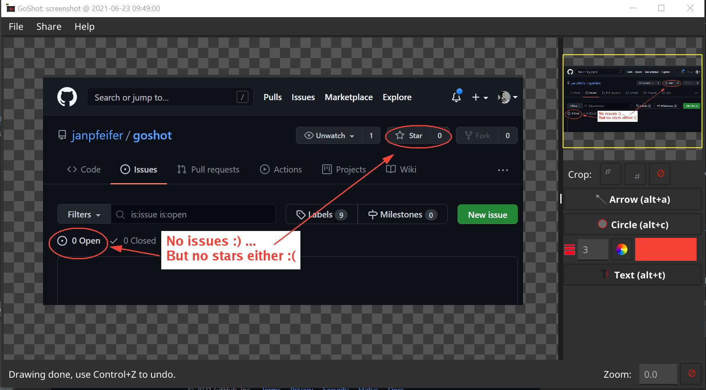

# GoShot

## Screenshot, annotate and share made easy

GoShot creates a screenshot of your display, which you can quickly
crop to the area of interest, annotate (arrows, circle and text) and
then easily share with others. 



Made for bug/issue reports, sharing screenshots by email, WhatsApp, or any other social network or 
communication tools.  

* Assign it to a favourite hotkey (shortcut), so it's readily available.

* Run it to capture a screenshot, which you can easily crop to the area of interest. It can also capture delayed
  screenshots: handy when one wants to screenshot opened menus. 
* **Annotate**: circles, arrows and text of different sizes and colors.

* **Share**:
   * Copy annotated image to clipboard (Control+C): and then paste into your email, WhatsApp (or other messenger / 
     social network), document, etc.
   * Save image to a file (Control+S), to include somewhere.
   * Share image in Google Drive (Control+G) and have the URL copied, so that you can paste it, for instance, in a 
     bug report.

* For Linux and Windows only for now. (*)

(*) Anyone willing to contribute with a macOS port? Maybe in Chromebooks as well ?

## Installation

### Windows (10)

There is no installation tool yet, so one needs to download the `goshot-win.zip` file from
the [latest release](https://github.com/janpfeifer/goshot/releases/download/v0.1.2/goshot-win.zip), and 
extract the `goshot.exe` file to your favourite binaries location. At home, I created a 
directory `c:\Tools` and I put manually installed binaries there.

#### Assigning to shortcut key (hotkey)

In Windows 10 a *shortcut key* can be easily assigned to a "shortcut file" **in the Desktop**. 
Elsewhere, it doesn't seem to work.

Right-click on the desktop, create a shortcut and point it to where you installed your GoShot `.exe`
file. Then right-click on the "shortcut file", in the Desktop, and assign a "shortcut key", which can
be assigned to a "Control+Alt+<some key>" combination.


#### Running in the System Tray

Alternatively, run GoShot with `--systray`, to have it show up as an icon in your system tray, 
from where you can select "Screenshot" anytime (with the mouse though). 

Create a "shortcut file", and add the --systray option.


### Linux: Gnome+Cinnamon

There is no installation tool yet, so one needs to download the `goshot.tar.gz` file from
the [latest release](https://github.com/janpfeifer/goshot/releases/download/v0.1.2/goshot-linux.tar.gz) (amd64 version
only so far), and extract the binary `goshot` file to your personal binary directory -- I use `${HOME}/bin`. Or if you
have the [Go language](https://golang.org) installed, install using that instead, see below.

#### Assigning to shortcut key (hotkey)

It will depend on your window manager. In my Gnome/Cinnamon set up I go to "Keyboard" settings, and add
a custom shortcut, very simple:


#### Running in the System Tray

Alternatively, run GoShot with `--systray`, to have it show up as an icon in your system tray,
from where you can select "Screenshot" anytime (with the mouse though).

```shell
$ nohup goshot --systray >& /tmp/goshot.out &
```


### Using [Go](https://golang.org) 

If you have the [Go language](https://golang.org) installed you can also simply do in Linux:

```shell
$ go install github.com/janpfeifer/goshot@latest
```

In Windows, you have to add a flag to tell it not to open the program in a terminal (cmd.exe):

```shell
$ go install -ldflags="-H windowsgui" github.com/janpfeifer/goshot@latest
```

In both cases it will compile (take a couple of minutes) and show up in your Go directory.

### Running in the System Tray

It shows up as an icon in your system tray, from where you can select "Screenshot" anytime (with the mouse though).

```shell
$ goshot --systray
```
* --systray: It will run and open an icon on the system tray, from where one can start a shortcut.

## License

It is distributed under [Apache License Version 2.0](LICENSE).

## Privacy Policy

GoShot stores in your local disk your preferences (e.g., colors, font size), and a temporary authorization token if you are 
using Google Drive.

Other than that, it will save and/or share images at your request.

GoShot uses Google Drive exclusively when requested to store and share the screenshot images, under the `GoShot` folder. 
The images will be visible to anyone with the URL link.

## Known issues and feature requests:

* **macOS (Darwin)** support: Clipboard code was contributed (thanks @mattbucci!). But I don't have access to a Mac to develop/maintain/build releases, so one will need to install using `go install`.

* Needs **better icons** and design -- I'm terrible at those :(

* Implement scrollbars on the side of the image editor: the native [Fyne](https://github.com/fyne-io/fyne) won't work. 
  Instead, one needs to move the image around by dragging, or using the minimap.
  
* Export to **Microsoft OneDrive**, **DropBox**, **others** ? -- I don't have account on those, contributions are very welcome!

* If running in the system tray, automatically add a global shortcut.

* Add flag to allow users to add their own GoogleDrive credentials, instead of using the public one for GoShot.